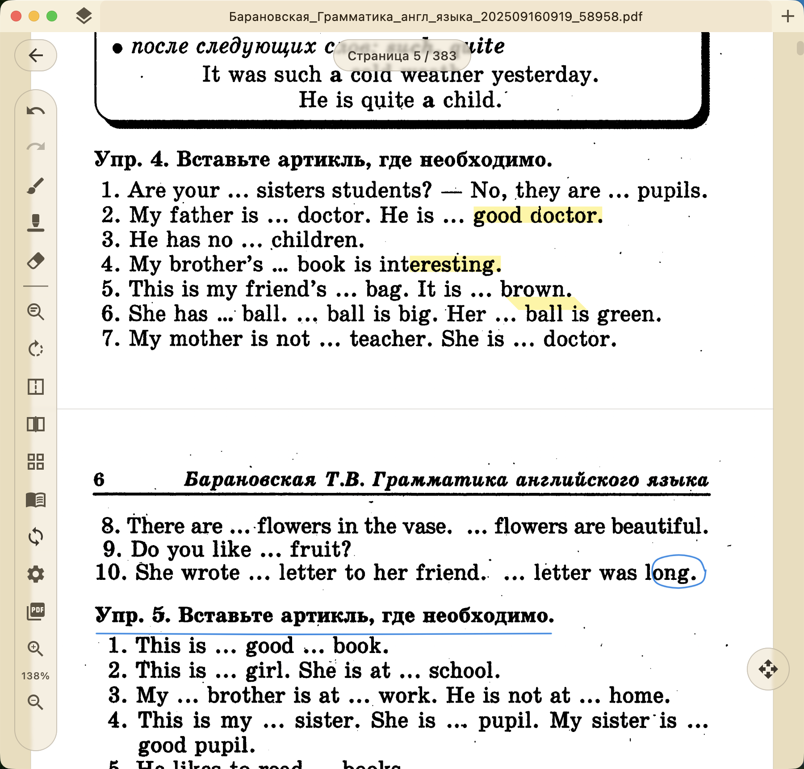
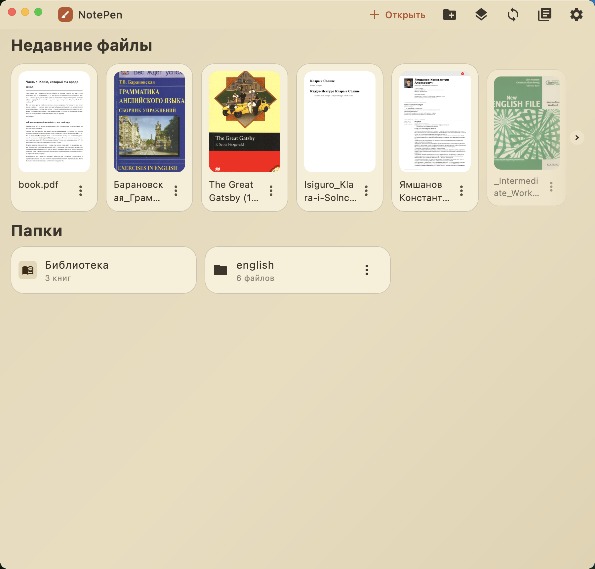
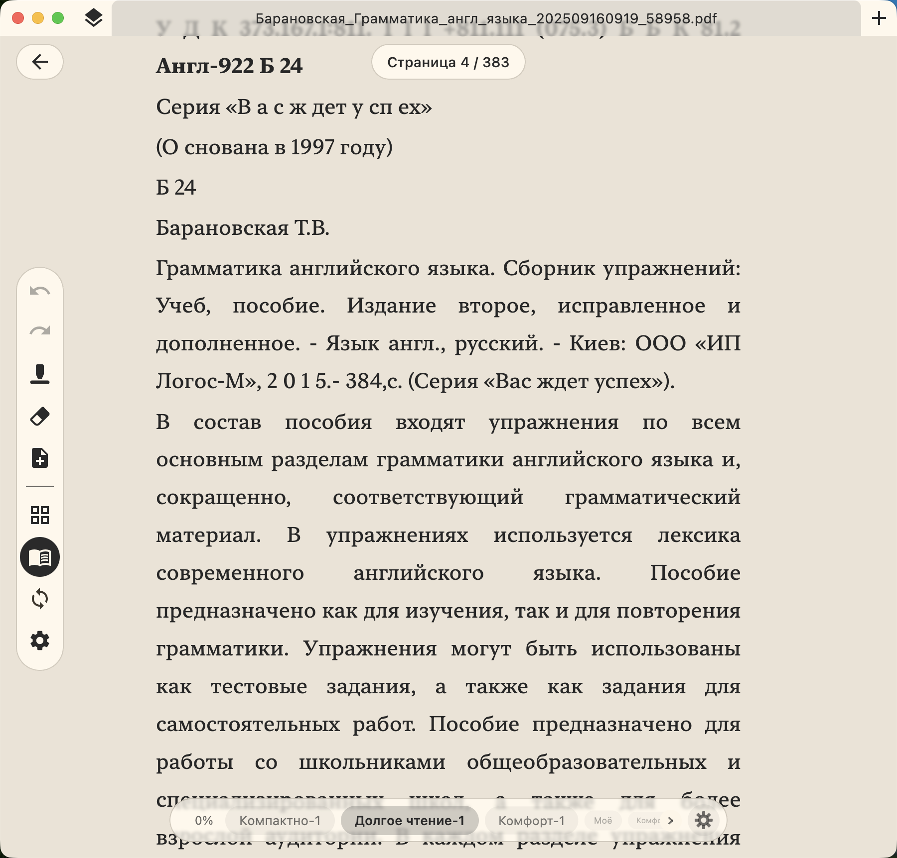
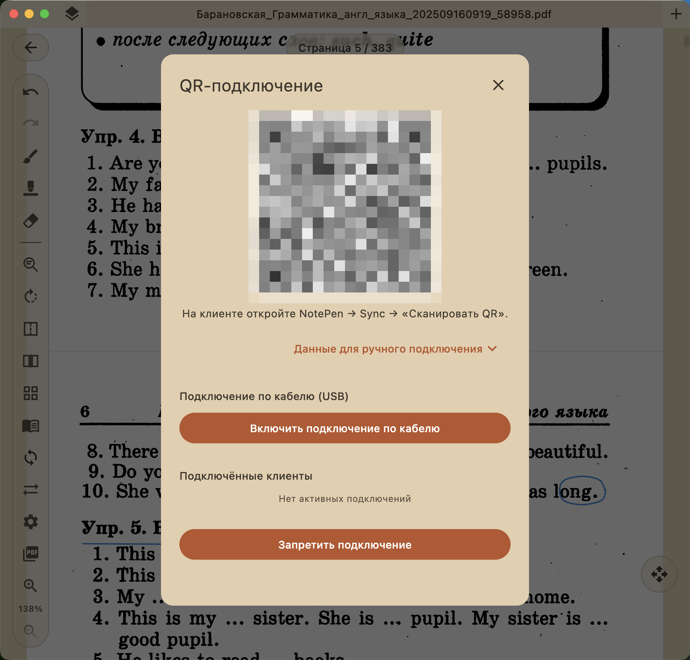

# NotePen

> A Kotlin Multiplatform PDF and document annotation app with an infinite canvas, tuned for stylus input.

<p align="center">
  
  
  
</p>

<p align="center">
  
</p>

NotePen lets you write and draw over PDFs and documents with a pen. It runs on Android and on Desktop/JVM (Windows, macOS, Linux) from a single shared codebase. The canvas extends beyond the page edges, so your notes are not boxed in by the document margins. If you have a second device on the same network, annotations sync between them directly, with no cloud account in the middle.

## Download

Grab a build from the [latest release](https://github.com/aequicor/NotePen/releases/latest):

- [Windows installer (.exe)](https://github.com/aequicor/NotePen/releases/latest)
- [Windows portable (.zip)](https://github.com/aequicor/NotePen/releases/latest)
- [macOS (.dmg)](https://github.com/aequicor/NotePen/releases/latest)
- [Linux (.deb)](https://github.com/aequicor/NotePen/releases/latest)
- [Android (.apk)](https://github.com/aequicor/NotePen/releases/latest)

Each link opens the latest release page, where you pick the file you need. For direct per-file download buttons, see the project website.

## Features

- **Infinite canvas.** Annotate on an unbounded surface that extends past the page, so notes, sketches, and mind maps are not constrained by the document margins.
- **Natural ink over PDF.** Import a PDF and draw or write over it like digital paper, with pen-pressure support tuned for stylus input.
- **Marker / highlighter.** A dedicated marker tool for highlighting content over the document.
- **Eraser.** Remove strokes. Erase operations are modeled as tombstone deltas, so they also propagate through sync.
- **Smart shape gestures.** Draw freehand, then hold the pen or finger to snap a sketch into a clean straight line or a selection, using on-device shape recognition and simplification.
- **Handwritten links.** Circle a piece of text or draw a symbol to create an interactive link to another page of the same document or to an external resource.
- **Reflow reading mode.** Extracts and re-flows document text into a comfortable reading view, with reading-comfort presets (built-in and custom), while keeping your annotations anchored to the text.
- **Multi-page viewer.** Read page by page in a single-page layout or a two-page spread, with a magnifier for precise stylus placement.
- **Autosave.** Edits are saved as you go. Close a document and come back later with annotations intact.
- **Peer-to-peer LAN sync.** Sync annotations between devices over the local network using Ktor WebSockets and mDNS discovery, with last-writer-wins merge per document. No cloud involved.
- **QR-code pairing.** Pair devices by generating and scanning a NotePen QR code.
- **EPUB / FB2 conversion.** Built-in conversion turns EPUB and FB2 e-books into paginated documents you can annotate like PDFs.

## Screenshots

| Library | Reading mode | Sync |
|---|---|---|
|  |  |  |

## Usage

1. Open a PDF, or import an EPUB or FB2 e-book, which is converted to a paginated document.
2. Write and draw over the page with a stylus, using pen pressure. Switch to the marker or eraser as needed.
3. Hold the pen or finger after a freehand stroke to snap it into a straight line or selection.
4. Circle text or draw a symbol to create a handwritten link to another page or an external resource.
5. Switch to reflow reading mode and pick a reading-comfort preset. Toggle single-page or two-page spread in the viewer.
6. Pair a second device by scanning a QR code to sync annotations over the local network. Edits autosave.

## Getting started

Download a build from the [latest release](https://github.com/aequicor/NotePen/releases/latest) and install it for your platform.

- **Windows:** run the installer, or unzip the portable build and launch it.
- **macOS:** open the `.dmg` and drag NotePen to Applications.
- **Linux:** install the `.deb`.
- **Android:** install the `.apk`. There is no Google Play listing.

If you want to build it yourself, see [Contributing](#contributing).

## Tech stack

- Kotlin Multiplatform
- Compose Multiplatform (shared UI)
- Decompose (navigation)
- PDFBox (JVM PDF rasterization and extraction)
- Android `PdfRenderer` (Android PDF rasterization)
- Ktor (WebSocket peer server and client)
- mDNS (local-network peer discovery)
- SQLDelight (offline delta queue, `NotePenSyncDatabase`)
- zxing (QR generation)
- ML Kit barcode and CameraX (QR scanning on Android)
- JetBrains Runtime (JBR) 25 toolchain for desktop
- Gradle with version catalog and configuration cache

Package root: `ru.kyamshanov.notepen`.

## Project structure

- **`:shared`** — domain core plus Decompose navigation contracts (`mainscreen`/`pdf`/`shortcuts` domains). Almost everything depends on it.
- **`:drawing:api` / `:drawing:impl`** — stroke model (`DrawingPath`, `DrawingPoint`), `PdfDrawingState`, shape recognition and simplification. The impl has the multi-page gesture controller and magnifier.
- **`:rendering:api` / `:rendering:impl`** — `PageRasterizer` plus bitmap-cache models. The impl has `DrawablePdfPage`, the multi-page viewer, tablet/stylus input, and the low-latency overlay. PDF rasterization via PDFBox (JVM) or Android `PdfRenderer`.
- **`:reflow:api` / `:reflow:impl`** — text-reflow reading mode. Classifies content, extracts and re-flows a `ReflowDocument`, and maps strokes to text. PDFBox (JVM) / pdfbox-android.
- **`:tools:marker`** — marker/highlighter tool UI built on `:drawing:api`.
- **`:sync`** — annotation sync: `SyncEngine` (per-document last-writer-wins merge of `StrokeDelta`), `KtorPeerServer`/`KtorSyncClient`, SQLDelight-backed offline delta queue.
- **`:qr-connect`** — QR pairing: zxing (generation, JVM) plus ML Kit barcode and CameraX (scanning, Android). Depends on `:sync`.
- **`:server`** — thin host-side aggregation module reserved for a future standalone host entrypoint.
- **`:library:api` / `:library:impl`** — library / document-source layer.
- **`:app:byCompose:common`** — shared Compose UI and app glue: screen components, ViewModels, dialogs, the EPUB/FB2 book-conversion layer, and PDF loader actuals.
- **`:app:byCompose:android` / `:app:byCompose:desktop`** — platform application modules (entry points, DI wiring, packaging).
- **`:app:byCompose:theme` / `:app:byCompose:uikit` / `:app:byCompose:blur`** — design-system modules (theming, reusable Compose components).

## Contributing

### Build from source

Clone the repo to get started:

```bash
git clone https://github.com/aequicor/NotePen.git
```

Libraries and Android modules compile to JVM 11. The desktop module pins a JetBrains Runtime (JBR) 25 toolchain (`jvmToolchain` language version 25), which is required for the custom Windows title bar (`setupJbrTitleBar`). foojay cannot auto-provision the JetBrains vendor, so on a machine without an auto-detected JBR, set `org.gradle.java.installations.paths` in your user `gradle.properties` to a locally installed JBR 25. Use a full `jbrsdk-25` with `jpackage`/`jlink` if you want to package.

| Task | Command |
|---|---|
| Build everything | `./gradlew build` |
| Run desktop app | `./gradlew runDesktop` |
| Install Android debug build | `./gradlew :app:byCompose:android:installDebug` |
| Run tests | `./gradlew test` |
| Lint / static analysis | `./gradlew detekt` |
| Format check | `./gradlew ktlintCheck` |
| Autoformat | `./gradlew ktlintFormat` |
| Full verification | `./gradlew check` |

`./gradlew check` runs build, tests, ktlintCheck, and detekt. Most logic tests run on the JVM in `commonTest`/`jvmTest`.

Dependencies and plugins live in the version catalog at `gradle/libs.versions.toml`, type-safe project accessors are enabled, and the Gradle configuration cache is on. The app version comes from the `app.version` Gradle property.

Packaged desktop builds are produced via Compose Desktop. `createReleaseDistributable` builds the app-image (ProGuard plus obfuscation). macOS and Linux installers come from jpackage (DMG and DEB). Windows is packaged with Inno Setup (`installer/windows/notepen.iss`), and a portable no-install Windows ZIP is produced by `packageReleasePortableZip`. Release tags must be `v1.0.0` or higher, because the macOS jpackage build rejects `0.x` versions.

### Pull requests

1. Fork the repo and create a branch for your change.
2. Make your change and add tests where it makes sense.
3. Run `./gradlew check` and make sure it passes (this covers build, tests, ktlint, and detekt).
4. Open a pull request against `master` with a clear description.

## License

NotePen is licensed under the Apache License 2.0. See [LICENSE.txt](LICENSE.txt) for the full text.
